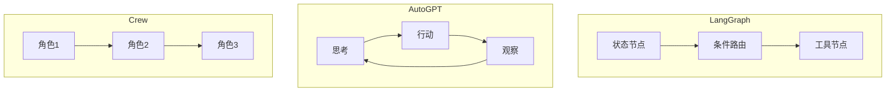

<!-- more -->

2026 年是"智能体框架"井喷的一年。当你决定用 LLM 构建一个能自主规划、调用工具、循环执行的 Agent 时，最先面对的问题就是：**该选哪个框架**。本文从编排模型、工具生态、稳定性三个维度，横评当下最主流的三款。

## 三者的编排模型

不同框架对"Agent 如何思考与行动"有截然不同的抽象。LangGraph 基于状态图，AutoGPT 倾向于自由循环，Crew 则用角色分工模拟团队协作。

## 横向对比

| 维度 | LangGraph | AutoGPT | Crew |
|---|---|---|---|
| 编排模型 | 有向状态图 | 思考-行动-观察循环 | 多角色协作 |
| 可控性 | ★★★★★ | ★★★ | ★★★★ |
| 上手成本 | 中 | 低 | 低 |
| 稳定性 | 高 | 中 | 中高 |
| 适合场景 | 复杂工作流 | 自主探索 | 多角色任务 |

## 选型建议

- **需要精确控制流程**：选 LangGraph。它的状态图让你对每一步都可见可控，适合企业级生产任务。
- **希望模型自主探索**：选 AutoGPT。它的循环结构给了模型最大自由度，但代价是稳定性需要你自己兜底。
- **任务天然多角色**：选 Crew。比如"研究员+写作员+审校员"这种分工明确的场景，Crew 的抽象最贴合直觉。

> 框架不是银弹。真正决定 Agent 成败的，是任务定义是否清晰、工具是否可靠、以及失败时能否优雅降级。

选择框架时，先问自己：这个任务的流程是确定的，还是开放的？确定流程用图，开放流程用循环，分工流程用角色。三者并非互斥，复杂系统往往是它们的组合。
