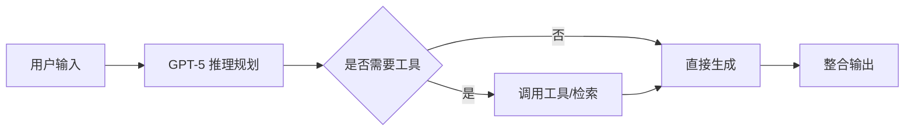

<!-- more -->

OpenAI 于今日正式发布下一代旗舰模型 **GPT-5**，这是自 GPT-4 发布以来最大幅度的一次能力升级。新模型在推理、编程、多模态理解与工具调用四个维度上均取得显著提升，同时将上下文窗口扩展至 **200 万 token**，可直接处理整本书或大型代码仓库。

## 核心能力提升

GPT-5 的训练融合了更大规模的合成数据与强化学习，团队重点强化了"慢思考"链路：模型在给出最终答案前，会先进行内部推理规划，再调用工具或检索外部信息，最后整合输出。这一改动让复杂任务的准确率明显提高。

下方流程图展示了 GPT-5 的典型推理路径：



## 各项能力对比

根据官方基准测试，GPT-5 在多个主流评测集上的表现如下：

```echarts
{
  "title": {"text": "GPT-5 各项能力得分"},
  "tooltip": {},
  "grid": {"left": "8%", "right": "8%", "bottom": "15%"},
  "xAxis": {"type": "category", "data": ["推理", "编程", "多模态", "长上下文", "工具调用"]},
  "yAxis": {"type": "value", "max": 100},
  "series": [{
    "type": "bar",
    "data": [88, 95, 82, 90, 86],
    "itemStyle": {"color": "#2997ff", "borderRadius": [6,6,0,0]}
  }]
}
```

可以看到，编程能力提升最为明显，得益于新引入的代码执行沙箱与自我纠错机制。

## 交互式可视化

GPT-5 的能力边界可以用一个交互式三维结构来直观感受（拖动可旋转）：

```three
{"shape": "icosahedron", "color": "#2997ff", "speed": 0.006}
```

## 价格与可用性

GPT-5 即日起向 ChatGPT Plus 与 Team 用户开放，API 按 $5 / 百万输入 token 计费。企业版用户将在两周内获得访问权限。OpenAI 表示，免费层用户后续也可在限额内体验 GPT-5 的轻量版本。

> 这是大模型从"对话"走向"代理"的关键一步：当模型能稳定规划、调用工具并整合结果，它就不再只是聊天机器人，而是真正的工作伙伴。

随着 GPT-5 落地，行业焦点正从"参数军备竞赛"转向"智能体可靠性"。下一个值得关注的，是它能否在真实生产环境中持续稳定地完成长链条任务。
